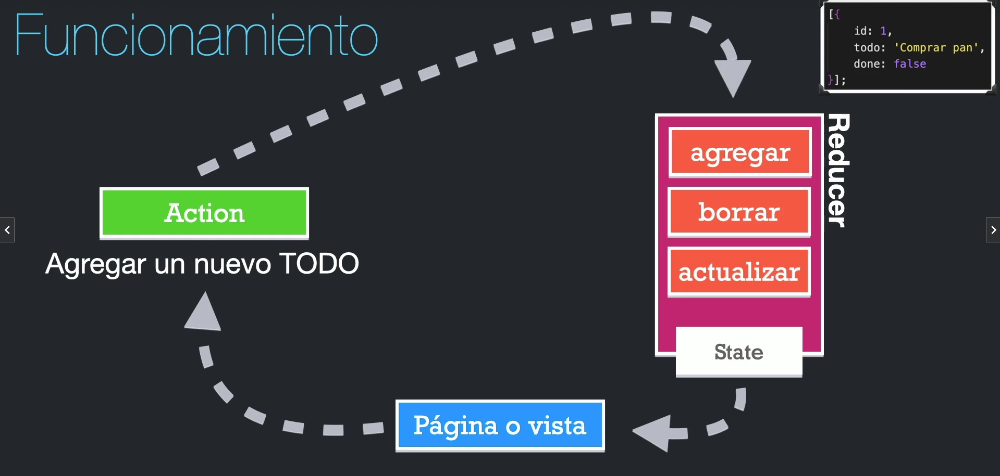

# What is React?

`React` es un _framework_ de _JavaScript_ el cual nos permite crear aplicaciones reactivas y dinámicas para la web, `React` puede ser utilizado en cualquier tipo de aplicación web, desde las más pequeñas hasta las más grandes. `React` usa _JSX_ para funcionar el cual nos permite crear código de _HTML_ con _JavaScript_.

# ¿Como funciona el renderizado en `React`?

Cada vez que es actualizado el estado, una dependencia del useEffect o similar y se dispare el renderizado de nuevo de la app `React` todo el código que está dentro de la aplicación de `React` de volverá a ejecutar, o sea, asignará en memoria de nuevo las variables, funciones, etc. Por este motivo se recomiendo que si deseas crear una función, variable o similar que no tenga que ver con una característica `React` lo defina fuera de la función de React.

# Hooks

_Hooks_ son una nueva característica en React 16.8. Estos te permiten usar el estado y otras características de React sin escribir una clase según [React](https://es.legacy.reactjs.org/docs/hooks-intro.html#motivation).

## UseState

`UseState` es un Hook que nos permite guarda el valor de una variable y que el componente recuerde dicho valor cada vez que sea actualizado, nos permite también hacer nuestra aplicación reactiva, lo que simboliza que cuando se actualice el estado también de vuelve a renderizar la aplicación.

### ¿Como usarlo?

`const [state, setState] = useState(initialState)`

-   **State:** El valor del estado en ese momento.
-   **SetState:** Función para actualizar el estado, le podemos mandar simplemente el valor o una función dentro de esta que retorne un valor. Debe ser pura, debe tomar el estado pendiente como único argumento y debe devolver el siguiente estado.
-   **InitialState:** Estado inicial, puede ser un valor directamente o una función que retorne un valor. Cabe recalcar que este valor será ignorado después del primer renderizado. En caso tal que mande una función debe ser pura y sin argumentos.

### Advertencias

-   Debes llamarlo en el nivel superior del componente. **NO PUEDES LLAMARLO DENTRO DE UN IF, FOR, O SIMILAR**.
-   La función set solo actualiza la variable de estado para el próximo renderizado. Si lees la variable de estado después de llamar a la función set, seguirás obteniendo el valor anterior que estaba en la pantalla antes de tu llamada.

### Tips

-   Por convención, es común nombrar el argumento de estado pendiente como la primera letra del nombre de la variable de estado, como _a_ para _age_. No obstante, también puedes llamarlo como prevAge o cualquier otra cosa que te resulte más clara.

## useEffect

`useEffect` se utiliza para que podamos ejecutar un efecto secundario en base a evento principal, por ejemplo, deseamos que cada vez que se actualice un número se guarde en la base de datos, entonces el efecto principal sería la actualización del número y en secundario sería guardar dicho número en la base de datos.
Según la documentación de [_React_](https://es.react.dev/reference/react/useEffect) el `useEffect` es usado para sincronizar un componente con un sistema externo, en el caso anterior sería la sincronización entre la base de datos y la web.

### ¿Como usarlo?

`useEffect(callback, [...dependencies])`

-   **Callback**: El callback es la función que sería ejecutada cuando se desee ejecutar el efecto. Esta función puede retornar otra función la cual será la encargada de limpiar cualquier interacción que haya en caso tal que sea necesario. Esta se ejecutará cuando el componente sea desmontado, por ejemplo, si nos conectamos a una base de datos, en el return del callback vamos a desconectarnos de dicha base de datos, a esto se le llama función clean up. Funcionaría similar al onMounted, o sea, cuando se desarme el componente se ejecutaría dicha función.
-   **Dependencies**: Son los valores que se tomarán en cuenta para ejecutar el efecto secundario, estas dependencias pueden ser estados, props, etc.

### Tips

-   Cuando usamos el modo estricto en _React_ (Strict mode) el _useEffect_ será ejecutado dos veces para poder detectar problemas en el ciclo de vida de la hook.
-   _React_ recomienda debe haber efecto especializados, o sea, no debemos tener un solo useEffect que haga todo, sino separarlo entre varios y que cada uno cumpla con una función en especifico.

## useRef

El _useRef_ es usado cuando deseamos almacenar alguna referencia o valor que cuando este sea actualizado el componente _no se vuelva a renderiza, o sea, actualizar_. Comúnmente es usado para almacenar la referencia a un elemento HTML.

### ¿Como usarlo?

`const ref = useRef(valorInicial)`

-   **Valor inicial**: Es el valor inicial que tendrá la referencia.
-   **ref**: Será un objeto con una sola propiedad la cual será current.

### Tips

-   Puedes mutar la propiedad _ref.current_. A diferencia del estado, es mutable. Sin embargo, si contiene un objeto que se utiliza para el renderizado (por ejemplo, una parte de tu estado), entonces no deberías mutar ese objeto.
-   Si cambias el estado _React_ no vuelve y renderiza el componente ya que no es dinámico, este se comporta como un objeto de JavaScript.
-   No escribas ni leas _ref.current_ durante el renderizado, excepto para la inicialización. Esto hace que el comportamiento de tu componente sea impredecible.
-   La información es local para cada copia de tu componente (a diferencia de las variables externas, que son compartidas).
-   No puedes definir una _ref_ en un componente actualizado. Si deseas hacer eso debes englobar el componente dentro de la función `forwardRef(componente)` al momento de crear el componente.

## useLayoutEffect

_useLayoutEffect_ es una versión de useEffect que se acciona antes que el navegador vuelva a pintar la pantalla. En otras palabras, _useLayoutEffect_ bloquea el navegador de pintarse.

### ¿Como usarlo?

`useLayoutEffect(setup, dependencies)`

-   **Callback**: El callback es la función que sería ejecutada cuando se desee ejecutar el efecto. Esta función puede retornar otra función la cual será la encargada de limpiar cualquier interacción que haya en caso tal que sea necesario. Esta se ejecutará cuando el componente sea desmontado, por ejemplo, si nos conectamos a una base de datos, en el return del callback vamos a desconectarnos de dicha base de datos.
-   **Dependencies**: Son los valores que se tomarán en cuenta para ejecutar el efecto secundario, estas dependencias pueden ser estados, props, etc.

### Tips

-   Si algunas de tus dependencias son objetos o funciones definidas dentro del componente, hay un riesgo de que ellas causen el efecto de volver a ejecutarse más de lo necesario. Para arreglar esto, elimina dependencias de objetos y funciones innecesarias. También puedes extraer actualizaciones de estados y lógica que no es reactiva fuera de tu Efecto.
-   El código dentro de useLayoutEffect y todas las actualizaciones de estado programadas desde él bloquean el navegador de volver a pintar en la pantalla. Cuando es usado excesivamente, puede hacer tu aplicación muy lenta. Cuando sea posible se prefiere usar useEffect. Renderizar en dos pasadas y bloquear el navegador perjudica el desempeño.

## memo

Se utiliza para memorizar componente y evitar su constante renderizado, esto se aplica cuando un componente padre cambia un estado pero aunque este estado no afecte al componente hijo este será actualizado, por ende, si tenemos un componente que hace procesos pesados sería buena idea usar memo.

### ¿Como usarlo?

`memo(componente)`

-   **Componente**: Este vendría siendo la definición de la función o componente al momento de crearlo que debe ser englobado por el _memo_

### Tips

-   Es recomendado usarlo unicamente cuando sea necesario, o sea, cuando baje el rendimiento de la página al momento de renderizar de nuevo el componente hijo cuando no sea necesario.

## useMemo

_useMemo_ es un Hook de React que te permite guardar en caché el resultado de un cálculo entre renderizados. Comúnmente es utilizado para almacenar resultados de funciones que consumen muchos recursos para evitar la ejecución constante de estas de forma innecesaria.

### ¿Como usarlo?

`const variable = useMemo(() => function(dependencies), [dependencies])`

-   **variable**: Será donde almacenos el valor que será memorizado, a este variable vamos a acceder siempre que queramos obtener dicho valor.
-   **function**: Debe ser contenida por una función pura que no acepte argumentos y devuelva cualquier valor y la **function** como tal debe ser la función que calcule cualquier valor.
-   **dependencies**: Son los valores reactivos que utilizará _React_ para saber cuando tiene que volver a ejecutar dicha función, si alguna de las _dependencias_ cambia se ejecutará de nuevo la función, en caso de que no persistirá el valor que ya tenemos.

### Tips

-   En el renderizado inicial, useMemo devuelve el resultado de llamar a calcularValor sin argumentos.
-   Debe ser usado solo si necesitamos mejorar el rendimiento, sino, es mejor usar un estado.
-   Guardar en caché valores como este también se conoce como _memoización_, y es por eso que el Hook se llama useMemo.

## useCallback

_useCallback_ es un Hook de React que te permite almacenar la definición de una función entre renderizados subsecuentes.

### ¿Como usarlo?

`const memoizedFunction = useCallback(functionToMemoize, [dependencies])`

-   **memoizedFunction**: Función memorizada, llamaremos a esta variable y la llamaremos como una función para acceder a la función memorizada.
-   **functionToMemoize**: Acá definiremos la función que deseemos memorizar, esta función puede recibir parámetros y devolver cualquier cosa. _React_ devolverá (¡no llamará!) tu función durante el renderizado inicial. Esta función no cambiará hasta que algunas de las dependencias cambien.
-   **dependencies**: Es lo que se tendrá en cuenta para volver a definir la función y tenga los valores actualizado. Funcionan iguales que en _useEffect_, _useMemo_ y similares.

## Reducer

Los reducers son funciones _sincrónicas_ y _puras_ que debe retornar siempre un nuevo estado. Estas funciones reciben un estado inicial y una acción, las características de estas funciones son:

-   Debe ser una función pura, o sea, los mismo valores de entrada obligatoriamente deben devolver los mismos de salida sin importar la veces que sea llamada y esta no debe tener efectos secundarios.
-   Siempre deben devolver un estado.
-   No deben tener actividades asincronícas.
-   No deben usar dentro de ellas el localStore ni el sessionStore. Porque estos métodos puede devolver errores y eso haría que la función al final no devuelva un estado

### Ciclo de vida

Miremos el ciclo de vida de un _Reducer_



-   Primero el _Reducer_ devuelve un estado.
-   El estado es recibido por la aplicación.
-   La página solicita una actualización del estado. _Ojo_ la página no debe actualizar o mutar el estado directamente, debe llamar a una de las acciones que el _Reducer_ tiene mapeado.
-   Una vez que la acción sea llamada el _Reducer_ actualizará el estado y lo devolverá. En caso tal, que la acción no exista en el _Reducer_ el tendrá que devolver el estado previo.

## useReducer

El _useReducer_ es un hook que nos permite definir un reducer, es comúnmente usado para centralizar la lógica de actualización de estado en un solo lugar y permitir que esta se pueda mantener de manera más fácil.

### ¿Como usarlo?

`const [state, dispatch] = useReducer(reducer, initialArg, init?)`

-   **State**: El _State_ será el estado del reducer, cabe recalcar que este será actualizado cada que se renderice de nuevo el componente, en caso tal que actualices el estado y desees acceder a la nueva versión de este no podrás hasta que se renderice de nuevo el componente.
-   **Dispatch**: Es lo que usarás para actualizar el estado, por convención, se envía un objeto con dos propiedades, _type_ para especificar el tipo de _Dispatch_ que se usará para actualiza el estado y por último, la propiedad _payload_ que será los argumentos que se enviarán para actualizar la función.
-   **Reducer**: Es la función encargada de manejar la lógica del estado, lo que planteamos en la sección anterior, este tendrá todos los _Dispatch_ y demás.
-   **InitialArg**: Es el valor inicial del estado.
-   **Init**: Es la función inicializadora que se ejecutará en caso tal que quieras definir el estado inicial a partir de lo que devuelva dicha función. Me explico, imagina que el _InitialArg_ tienes un id, pero deseas que el estado inicial sea un _username_, por ende, necesitas pasar dicho _id_ a una función, para ello se recomienda usar el parámetro _init_ en el cual pasarás la función directamente y se definirá como estado inicial lo que devuelva esa función. ¿Por qué no pasar como _initialArg_ la función directamente con el _id_ como parámetro? Porque si hacemos eso, la función se llamaría siempre que se actualice el estado, lo cual, termina siendo menos optimo que pasarla como _init_ que evita este comportamiento.

## createContext

Lo utilizamos para crear un contexto el cual nos permitirá acceder valores desde hijos de dicho contexto, los componentes podrán leer este o proporcionarlo. Este contexto funciona como un estado global, o sea, nos permitirá actualizar los componentes si el estado cambian, provocando que sea dinámico, como un _useState_.

### ¿ Como usarlo?

`const SomeContext = createContext(defaultValue)`

-   **defaultValue**: Es el valor por defecto que tendrá el contexto, o sea, en caso tal que no haya un valor se tomará dicho valor por defecto para que el contexto pueda devolver algo o si no existe un contexto devolverá dicho valor. Dicho valor por defecto debe ser estático y no cambiar con el tiempo. Si no tiene ningún valor predeterminado significativo, especifica _null_.
-   **SomeContext**: Cuando creemos un contexto este nos devolverá un objeto con dos propiedades. Estas son:

    -   **SomeContext.Provider**: Te permite proporcionar el valor de contexto a los componentes. Esto se hace envolviendo dichos componentes en este para que puedan acceder a su valor.
        Esto recibe una prop, dicha prop es _value_, esta será el valor que tendrá el contexto y por ende, los componentes que lean a esta obtendrán dicho valor. Esto ocurre sin importar lo profundo que esté el componente.
        Un componente que llama a useContext(SomeContext) dentro del proveedor recibe el valor (value) del proveedor de contexto más cercano que tenga.

        ```tsx
        function App() {
            const [theme, setTheme] = useState("light");
            return (
                <ThemeContext.Provider value={theme}>
                    <Page />
                </ThemeContext.Provider>
            );
        }
        ```

    -   **SomeContext.Consumer**: Es una forma alternativa y poco utilizada de leer el valor del contexto. Esto es debido a que se creó antes de que existiera el _useContext_, por ende, se recomienda usar el _useContext_ en vez de _SomeContext.Consumer_.
        El recibe como prop un _children_ esto es una función. React llamará a la función que pases con el valor de contexto actual determinado por el mismo algoritmo que useContext() y renderizará el resultado que devuelves de esta función. React también volverá a ejecutar esta función y actualizará la interfaz de usuario siempre que el contexto pasado desde los componentes principales haya cambiado.
        ```tsx
        function Button() {
            // 🟡 Forma antigua (no recomendado)
            return (
                <ThemeContext.Consumer>
                    {(theme) => <button className={theme} />}
                </ThemeContext.Consumer>
            );
        }
        ```

## Añadidos y referencias

Página de _React_ [AQUÍ](https://es.react.dev/)

**Si quieres aprender sobre como testear aplicaciones de React puedes acceder a estas notas. [AQUÍ](Test.md)**
