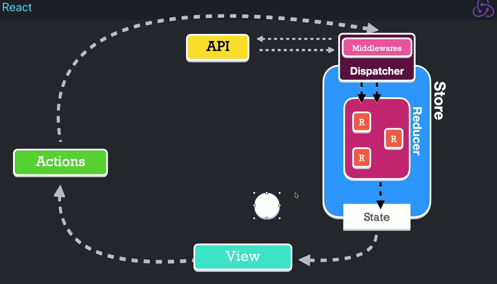

# Redux

Redux es una librería que nos permite manejar un estado global. Antes de explicar como funciona primero desglosemos el vocabulario.

-   _Redux:_ librería encargada de manejar un estado global mediante reducer.
-   _React Redux:_ Sería la forma tradicional de trabajar con Redux en aplicaciones de React. Este tiene el problema que hay mucho _boilerplate_, o sea, tenemos que escribir mucho código para que algo funcione. Esto ocurre principalmente si queremos manejar tareas asíncronas.
-   _Redux toolkit:_ Nos permite implementar el patrón Redux en nuestra aplicaciones de React de forma más sencilla

Redux es el patrón de diseño que maneja los estados mediante reducers. Esto provoca que se predecible el comportamiento de los estados.
Podemos tener actualizaciones de estados asincronícas.

## Funcionamiento de Redux

-   Tenemos la _view_ que sería el componente de React que solicita la información, dicha información viene de la fuente de la verdad el cual es el _Store._
-   Tenemos las _Actions_ que son funciones que se encargan de solicitar al _Store_ que el estado sea actualizado.
-   Para llamar dichas acciones las _Actions_ los _dispatchers_. Estos son los encargados de denominar si la acción es asíncrona o síncrona, dentro de los _dispatchers_ están los _middlewares_ que se encargarán de realizar las funciones asíncronas para poder convertir la acción síncrona y llegue al Reducer.
-   _Store_ es el estado y los _reducers_, la fuente de la verdad, dentro de está están los _reducers_ y está el _estado_
